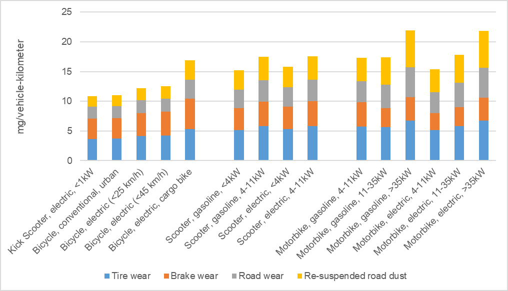

.. _model:

Modeling
========

This document describes the ``carculator_two_wheeler`` model, assumptions
and inventories as exhaustively as possible.

Overview of ``carculator_two_wheeler``
--------------------------------------

``carculator_two_wheeler`` is an open-source Python library. Its code is publicly
available via its `Github repository <https://github.com/romainsacchi/carculator_two_wheeler>`__.
You can also :download:`download an examples notebook <_static/resources/examples.zip>`, that guides new users into performing life cycle analyses.

The vehicles included in the two-wheelers category are:

* Kick scooters, electric
* Bicycles, conventional
* Bicycles, electric, with a top speed of 25 km/h
* Bicycles, electric, with a top speed of 45 km/h
* Bicycles, electric, cargo type
* Scooters, gasoline
* Scooters, electric
* Motorbikes, gasoline
* Motorbikes, electric

Size classes
************

Some of these vehicles are defined across several power categories and powertrain types.

.. _table-1:

.. table:: Table 1: Overview of vehicles included in the two-wheelers category
   :widths: auto
   :align: center

   +-----------------------------+--------------+--------------+-----------+------------+---------------+--------------+----------------+
   |                             | **Gasoline** | **Electric** | **<1 kW** | **1-4 kW** | **4-11 kW**   | **11-35 kW** | **> 35kW**     |
   +=============================+==============+==============+===========+============+===============+==============+================+
   | Kick scooters               |              | x            | x         |            |               |              |                |
   +-----------------------------+--------------+--------------+-----------+------------+---------------+--------------+----------------+
   | Electric bicycles (< 25km/h)|              | x            | x         |            |               |              |                |
   +-----------------------------+--------------+--------------+-----------+------------+---------------+--------------+----------------+
   | Electric bicycles (< 45km/h)|              | x            | x         |            |               |              |                |
   +-----------------------------+--------------+--------------+-----------+------------+---------------+--------------+----------------+
   | Electric bicycles, cargo    |              | x            | x         |            |               |              |                |
   +-----------------------------+--------------+--------------+-----------+------------+---------------+--------------+----------------+
   | Scooters                    | x            | x            |           | x          | x             |              |                |
   +-----------------------------+--------------+--------------+-----------+------------+---------------+--------------+----------------+
   | Motorbikes                  | x            | x            |           |            | x             | x            | x              |
   +-----------------------------+--------------+--------------+-----------+------------+---------------+--------------+----------------+

The power intervals chosen correspond roughly to the required driving license types in Europe and Switzerland.
AM, A1, A2, and A-type driving licenses are required for vehicles with an engine power inferior to 4 kW (including scooters),
between 4 and 11 kW, between 11 and 35 kW, and above 35 kW, respectively.

Modeling considerations applicable to all two-wheelers
------------------------------------------------------

* For all vehicles, the passenger mass is 75 kilograms.
* For all vehicles, the vehicle datasets use one vehicle unit as a functional unit, and the corresponding transport activity uses one vehicle-kilometer as a functional unit.

Modeling considerations applicable to internal combustion engine vehicles
-------------------------------------------------------------------------
Several fuel-related emissions other than CO2 and SO2 are considered using
the EMEP EEA’s 2019 Air Pollutant Emissions Inventory Guidebook :cite:`ct-1028`.

Two sources of emissions are considered:

* Exhaust emissions: emissions from fuel combustion during operation, and their concentration relates to fuel consumption and the vehicle's emission standard.
* Other non-exhaust emissions: brake, tire, and road wear emissions, emissions of refrigerant, and noise.

Exhaust emissions per vehicle-kilometer for two-wheelers are summarized in :ref:`Table 2 <table-2>`.

.. _table-2:

.. csv-table:: Table 2: Exhaust emissions for two-wheelers, in grams per vehicle-kilometer.
    :file: _static/tables/table-1.csv
    :widths: auto
    :align: center
    :header-rows: 1

:ref:`Figure 1 <figure-1>` shows the calculated abrasion emissions for two-wheeled vehicles in mg per vehicle-kilometer.

.. _figure-1:

    *Figure 1: Total particulate matter emissions (<2.5 µm and 2.5-10 µm) in mg per vehicle-kilometer for two-wheeled vehicles.*

Kick-scooters, electric
-----------------------
Illustrations of available models of electric kick-scooters considered in this study:

.. image:: /_static/img/image_2.png
    :width: 41%

.. image:: /_static/img/image_3.png
    :width: 50%

|s_caption| *Ninebot Mini Pro by Segway (Left) and Mi Pro 2 by Xiaomi (Right)* |e_caption|

Specifications (i.e., curb mass, motor power, battery capacity) for commercially available
electric kick-scooters are available in :ref:`Annex B <annex-b>`. Specifications used to represent an average
kick-scooter are detailed in :ref:`Table 3 <table-3>`. Kick-scooter energy consumption values are not
modeled but extracted from :cite:`ct-1092`, where kick-scooter users have reported their
electricity consumption.

The :cite:`ct-1047` v.3 datasets for manufacturing a 17 kg heavy bicycle
:cite:`ct-1048` is used as a proxy for the supply of the glider. The
transport of the vehicle from the assembly plant to the intended market is included: 15’900
km by transoceanic container ship and 1’000 km by truck (with a fleet-average vehicle). No
requirement for road maintenance is attributed to the vehicle due to its lightweight and small
size, following the previous implementation in :cite:`ct-1047` v.3 for bicycles.

The dataset for the AC charger is based on the :cite:`ct-1047` v.3 dataset “charger
production, for electric scooter”. It has been scaled down to represent a power output of 100
Watts.

.. note::

    * **Important assumption:** No maintenance operation (incl. parts replacement) or battery
      replacement is assumed throughout the vehicle's lifetime. The energy consumption values in
      :ref:`Table 3 <table-3>` are about twice as high as those used in :cite:`ct-1012`, based on
      manufacturers’ claimed range autonomy and battery size. However, even with such values,
      the cumulated electricity required over the vehicle's lifetime is about 42 kWh. A usable
      battery capacity of 0.2 kWh represents a bit more than 210 charge cycles, which should not
      require a second battery. The absence of battery replacement differs from what is assumed
      in :cite:`ct-1048` and is currently implemented in :cite:`ct-1004`, where one replacement is considered.
    * **Important assumption:** It is believed that the energy consumption values represent the
      consumption at the “wall plug” level, including charger loss and losses occurring at the
      battery level during charge. Suppose the energy use values reported by :cite:`ct-1092`
      users are, in fact, at “battery level”. In that case, the electricity use values considered in this
      study are potentially underestimated by approximately 5% (i.e., battery charge losses).
    * **Important remark:** Based on energy consumption values reported by users to
      :cite:`ct-1092`, and considering a maximum depth of discharge of 80%, the range autonomy
      obtained is significantly different from what is claimed by manufacturers (i.e., 8 to 10 km
      calculated, as opposed to >20 km according to manufacturers – see :ref:`Annex B <annex-b>`).
      Important remark: No requirement for road maintenance is attributed to the vehicle due to
      its lightweight, as previously considered for conventional and electric bicycles :cite:`ct-1048`.

.. _table-3:

.. table:: Table 3: Specifications for kick-scooters
   :widths: auto
   :align: center

   +-------------------------------+--------------------------+-----------------------------------+-------------------------------+
   | |kick-scooter-img|            | **Kick Scooter,**        | **Comment**                       | **Source**                    |
   |                               | **electric, <1kW - 2020**|                                   |                               |
   +===============================+==========================+===================================+===============================+
   | Lifetime [km]                 | 1’785                    | Lifetime, annual mileage, and     | :cite:`ct-1092`               |
   +-------------------------------+--------------------------+ energy consumption values were    +                               +
   | Annual kilometers [km]        | 890                      | calculated from actual usage      |                               |
   +-------------------------------+--------------------------+ values reported to :cite:`ct-1092`+                               +
   | Energy consumption [MJ/km]    | 0.086 (2.6)              | based on a sample of 10           |                               |
   | (kWh/100 km)                  |                          | (8’945 km cumulated).             |                               |
   +-------------------------------+--------------------------+-----------------------------------+-------------------------------+
   | Passenger mass [kg]           | 75                       | Standard assumption.              |                               |
   +-------------------------------+--------------------------+-----------------------------------+-------------------------------+
   | Cargo mass [kg]               | 0                        |                                   |                               |
   +-------------------------------+--------------------------+-----------------------------------+-------------------------------+
   | Curb mass [kg]                | 12 [1]_                  | Based on manufacturers’ data.     | Segway Ninebot, iWatt, Xiaomi |
   +-------------------------------+--------------------------+-----------------------------------+-------------------------------+
   | Driving mass [kg]             | 87 [1]_                  | Calculated.                       |                               |
   +-------------------------------+--------------------------+-----------------------------------+-------------------------------+
   | Power [kW]                    | 0.25                     | Based on manufacturers’ data.     | Segway Ninebot, iWatt, Xiaomi |
   +-------------------------------+--------------------------+-----------------------------------+                               +
   | Electric energy stored [kWh]  | 0.25                     | Based on manufacturers’ data.     |                               |
   +-------------------------------+--------------------------+-----------------------------------+-------------------------------+
   | Range autonomy [km]           | 8-10                     | Calculated.                       |                               |
   +-------------------------------+--------------------------+-----------------------------------+-------------------------------+
   | Depth of discharge [%]        | 80%                      | Standard assumption to preserve   | Similar assumptions used by   |
   |                               |                          | battery lifetime                  | :cite:`ct-1012`               |
   +-------------------------------+--------------------------+-----------------------------------+                               +
   | Battery replacement [unit]    | 0                        | Standard assumption for this      |                               |
   |                               |                          | type of vehicle                   |                               |
   +-------------------------------+--------------------------+-----------------------------------+                               +
   | Servicing per lifetime [unit] | 0                        | Standard assumption for this      |                               |
   |                               |                          | type of vehicle                   |                               |
   +-------------------------------+--------------------------+-----------------------------------+-------------------------------+

-----------

.. [1] Mass values considering a Li-NMC battery. Mass values will slightly change with Li-LFP and Li-NCA batteries due to a different cell energy density. Refer directly to the implemented dataset.

.. |kick-scooter-img| image:: /_static/img/image_4.png
    :width: 100%

Bicycle, conventional
---------------------
Examples of available models of urban bicycles considered in this study:

.. image:: /_static/img/image_5.png
    :width: 42%

.. image:: /_static/img/image_6.png
    :width: 50%

|s_caption| *MINT model by CANDY (Left) and Commuter 5 by Canyon (Right)* |e_caption|

Regarding the expected kilometric lifetime and annual mileage, the values from
:cite:`ct-1048` are used. These values are used in Mobitool v.2.1
:cite:`ct-1004`: 15’000 km over 15 years, giving an annual mileage of 1’000 km.

Datasets for conventional bicycle production present in :cite:`ct-1047` v.3, initially
from :cite:`ct-1048`, are used. However, its use has been scaled
down to fit the mass of current average bicycles (i.e., 12 kg, against 17 kg initially). The
transport of the vehicle from the assembly plant to the intended market is included: 15’900
km by transoceanic container ship and 1’000 km by a fleet-average truck.

Specifications used to represent an average conventional bicycle are detailed in :ref:`Table 4 <table-4>`.

.. _table-4:

.. table:: Table 4: Specifications for conventional bicycles
   :widths: auto
   :align: center

   +-------------------------------+--------------------------+-----------------------------------+-------------------------------+
   | |bicycles-img|                | **Bicycle, conventional**| **Comment**                       | **Source**                    |
   |                               | **, urban - 2020**       |                                   |                               |
   +===============================+==========================+===================================+===============================+
   | Lifetime [km]                 | 15’000                   | Standard assumption               | A similar assumption is used  |
   +-------------------------------+--------------------------+ (1’000 km/year)                   + in :cite:`ct-1048` and is     +
   | Annual kilometers [km]        | 1’000                    |                                   | currently used in             |
   +-------------------------------+--------------------------+-----------------------------------+ Mobitool v.2.1 :cite:`ct-1004`+
   | Passenger mass [kg]           | 75                       | Standard assumption.              |                               |
   +-------------------------------+--------------------------+-----------------------------------+                               +
   | Cargo mass [kg]               | 1                        | Standard assumption.              |                               |
   +-------------------------------+--------------------------+-----------------------------------+                               +
   | Curb mass [kg]                | 12                       | Based on manufacturers’ data.     |                               |
   +-------------------------------+--------------------------+-----------------------------------+-------------------------------+
   | Driving mass [kg]             | 88                       | Calculated.                       |                               |
   +-------------------------------+--------------------------+-----------------------------------+-------------------------------+
   | Servicing per lifetime [unit] | 1                        | The original :cite:`ct-1047` v.3  | :cite:`ct-1047`               |
   |                               |                          | datasets for maintenance          |                               |
   |                               |                          | :cite:`ct-1048` is valid for the  |                               |
   |                               |                          | entire lifetime of the bicycle    |                               |
   |                               |                          | (which is 15’000 km). Note that   |                               |
   |                               |                          | despite a lighter weight (12 kg   |                               |
   |                               |                          | against 17 kg), we do not adjust  |                               |
   |                               |                          | the requirements for maintenance. |                               |
   +-------------------------------+--------------------------+-----------------------------------+-------------------------------+

.. |bicycles-img| image:: /_static/img/image_7.png
    :width: 100%

Bicycle, electric
-----------------
Illustrations of available models of urban electric bicycles considered in this study:

.. image:: /_static/img/image_8.png
    :width: 32%

.. image:: /_static/img/image_9.png
    :width: 28%

.. image:: /_static/img/image_10.png
    :width: 33%

|s_caption| *Zouma Supreme+ S model by Diamant (max. 45 km/h) (Left), Cult EVO model by Atala (max. 25 km/h) (Middle) and Cargo Bike by RadWagon (Right)* |e_caption|

Annual mileage values are collected from :cite:`ct-1092`. They deviate by a factor of 2 to 3
from the yearly mileage values previously used in :cite:`ct-1048`:
2’000, 3’000, and 2’000 kilometers per year for the slow (max. speed <25 km/h), fast (max.
speed <45 km/h) and electric cargo bicycles respectively, against 1’000 km in the report
from :cite:`ct-1048`.
In addition, electric bicycles are generally designed to have a longer kilometric lifetime
comparatively to conventional bicycles, with an overall heavier chassis and reinforced tires.
But the onboard electronics and battery management system cannot possibly last 15 years
on average – as previously assumed in :cite:`ct-1048` – given such
annual mileage. Hence, the calendar lifetime is reduced to 10 years to obtain a kilometric
lifetime of 20’000 km, 30’000 km, and 20’000 km for the slow, fast, and cargo electric
bicycles, respectively.

The frame and mechanical powertrain are modeled using an input from the
:cite:`ct-1047` dataset for electric bicycle production, from which the inputs for the
electric motor and battery have been removed to size them separately. The input required
from the electric bicycle production dataset is scaled on the driving mass minus the mass of
the electric motor and battery, as this mass differs from what is initially considered in the
dataset: 24 kg, against 23, 27, and 46 kg considered here for the slow, fast and cargo
electric bicycles, respectively.

The transport of the vehicle from the assembly plant to the intended market is included:
15’900 km by ship and 1’000 km by truck. Abrasion emissions are scaled on the driving
mass, but the datasets for abrasion emissions of passenger cars in :cite:`ct-1047`
are used to approximate their composition.

A 500W charger dataset has been created based on the :cite:`ct-1047` dataset for
an electric scooter charger, and it has been scaled down accordingly based on the power
output. This follows the approach used by :cite:`ct-1012`.

The disposal of the bicycle is specified separately.

.. note::

    * **Important remark:** No requirement for road maintenance is attributed to the vehicle due to
      its lightweight and small size, as previously considered in :cite:`ct-1048`.
    * **Important remark:** Based on energy consumption data reported to :cite:`ct-1092`, and
      considering a maximum depth of discharge of 80%, range autonomy values are found to be
      twice to thrice as low as what is claimed by manufacturers (e.g., 32 km for 45 km/h electric
      bicycles, as opposed to >90 km according to manufacturers – see :ref:`Annex A <annex-a>`).

Specifications (i.e., curb mass, motor power, battery capacity, and range autonomy) for
commercially available electric bicycles in :ref:`Annex A <annex-a>`. Specifications for electric bicycles
considered in this study are presented in :ref:`Table 5 <table-5>`.

.. _table-5:

.. table:: Table 5: Specifications for electric bicycles
   :widths: auto
   :align: center

   +-------------------------------+--------------------------+--------------------------+--------------------------+-----------------------------------+-------------------------------+
   | |e-bicycles-img|              | **Bicycle, electric**    | **Bicycle, electric**    | **Bicycle, electric**    | **Comment**                       | **Source**                    |
   |                               | **(<25 km/h) - 2020**    | **(<45 km/h) - 2020**    | **(cargo)**              |                                   |                               |
   +===============================+==========================+==========================+==========================+===================================+===============================+
   | Lifetime [km]                 | 20’000                   | 30’000                   | 20’000                   | Annual mileage and energy         | :cite:`ct-1092`               |
   +-------------------------------+--------------------------+--------------------------+--------------------------+ consumption values calculated from+                               +
   | Annual kilometers [km]        | 2’000                    | 3’000                    | 2’000                    | actual usage values reported to   |                               |
   +-------------------------------+--------------------------+--------------------------+--------------------------+ :cite:`ct-1092` based on a sample +                               +
   | Energy consumption [MJ/km]    | 0.025 (0.75)             | 0.045 (1.38)             | 0.035 (1.06)             | of 69 for “slow” electric bicycles|                               |
   |                               |                          |                          |                          | (350’000 km cumulated), 21 for    |                               |
   |                               |                          |                          |                          | “fast” electric bicycles (230’000 |                               |
   |                               |                          |                          |                          | km cumulated) and 4 for electric  |                               |
   |                               |                          |                          |                          | cargo bikes (8,200 km cumulated). |                               |
   |                               |                          |                          |                          | The lifetime has been estimated by|                               |
   |                               |                          |                          |                          | multiplying the annual mileage by |                               |
   |                               |                          |                          |                          | ten years                         |                               |
   +-------------------------------+--------------------------+--------------------------+--------------------------+-----------------------------------+-------------------------------+
   | Passenger mass [kg]           | 75                       | 75                       | 75                       | Standard assumption.              |                               |
   +-------------------------------+--------------------------+--------------------------+--------------------------+-----------------------------------+-------------------------------+
   | Cargo mass [kg]               | 1                        | 1                        | 50                       |                                   |                               |
   +-------------------------------+--------------------------+--------------------------+--------------------------+-----------------------------------+-------------------------------+
   | Curb mass [kg]                | 23 [2]_                  | 27 [1]_                  | 45 [1]_                  | Based on manufacturers’ data.     | Cube,Haibike, Raleigh,Fischer |
   +-------------------------------+--------------------------+--------------------------+--------------------------+-----------------------------------+-------------------------------+
   | Driving mass [kg]             | 99 [1]_                  | 103 [1]_                 | 170                      | Calculated.                       |                               |
   +-------------------------------+--------------------------+--------------------------+--------------------------+-----------------------------------+-------------------------------+
   | Power [kW]                    | 0.25                     | 0.5                      | 0.25                     | Based on manufacturers’ data.     | Cube, Haibike, Raleigh,       |
   +-------------------------------+--------------------------+--------------------------+--------------------------+-----------------------------------+ Fischer, Babboe               +
   | Electric energy stored [kWh]  | 0.5                      | 0.5                      | 0.5                      | Based on manufacturers’ data.     |                               |
   +-------------------------------+--------------------------+--------------------------+--------------------------+-----------------------------------+-------------------------------+
   | Range autonomy [km]           | 60                       | 32                       | 40                       | Calculated.                       |                               |
   +-------------------------------+--------------------------+--------------------------+--------------------------+-----------------------------------+-------------------------------+
   | Depth of discharge [%]        | 80%                      | 80%                      | 80%                      | Standard assumption to preserve   | Similar assumptions were used |
   |                               |                          |                          |                          | the battery lifetime.             | by :cite:`ct-1012`            |
   |                               |                          |                          |                          |                                   |                               |
   +-------------------------------+--------------------------+--------------------------+--------------------------+-----------------------------------+                               +
   | Battery replacement [unit]    | 1                        | 1                        | 1                        | Standard assumption for this type |                               |
   |                               |                          |                          |                          | of vehicle                        |                               |
   +-------------------------------+--------------------------+--------------------------+--------------------------+-----------------------------------+-------------------------------+
   | Servicing per lifetime [unit] | 1.33                     | 2                        | 1.33                     | The original :cite:`ct-1047`      |                               |
   |                               |                          |                          |                          | datasets for maintenance assumes  |                               |
   |                               |                          |                          |                          | a lifetime 15’000 km, yielding a  |                               |
   |                               |                          |                          |                          | factor superior to 1.             |                               |
   +-------------------------------+--------------------------+--------------------------+--------------------------+-----------------------------------+-------------------------------+

------------

.. [2] Mass values considering a Li-NMC battery. Mass values will slightly change with Li-LFP and Li-NCA batteries due to a different cell energy density. Refer to the implemented dataset directly.

.. |e-bicycles-img| image:: /_static/img/image_11.png
    :width: 100%

Scooter, gasoline
-----------------
Examples of available models of gasoline scooters considered in this study:

.. image:: /_static/img/image_12.png
    :width: 45%

.. image:: /_static/img/image_13.png
    :width: 50%

|s_caption| *Vespa Primavera model by Piaggio (50 cm3, <4 kW) (Left) and PCX 125 model by Honda (125 cm3, 4-11 kW) (Right)* |e_caption|

Fuel consumption values are extracted from :cite:`ct-1092` over a cumulated mileage of 6.6 million vehicle-kilometers.

The national vehicle registry (MOFIS) from :cite:`ct-1003` is used to obtain the age of
gasoline scooters when discarded. The road transport survey data from TRACCS
:cite:`ct-1060` for Switzerland in 2010 is used to get the annual mileage of
mopeds/scooters. The values calculated are presented in :ref:`Table 6 <table-6>`.

.. _table-6:

.. table:: Table 6: Kilometric and calendar lifetime values for gasoline scooters
   :widths: auto
   :align: center

   +--------------------------------------+-----------------------------------+--------------------------------------+
   |                                      | **Age of decommissioning (i.e.,** | **Cumulated mileage reached at the** |
   |                                      | **calendar lifetime) [years]**    | **age of decommissioning (i.e.,**    |
   |                                      |                                   | **kilometric lifetime) [km]**        |
   +======================================+===================================+======================================+
   | **Source**                           | MOFIS registry :cite:`ct-1003`    | TRACCS 2010 survey data for          |
   |                                      |                                   | Switzerland :cite:`ct-1060`          |
   +--------------------------------------+-----------------------------------+--------------------------------------+
   | **Comment**                          | Outliers have been removed (i.e., | Annual mileage values for “Mopeds”   |
   |                                      | <5 years and >30 years).          | and "2-s motorcycles".               |
   |                                      | Corresponds to gasoline-fueled    |                                      |
   |                                      | “kleinmotorrad” in the registry.  |                                      |
   +--------------------------------------+-----------------------------------+--------------------------------------+
   | **Sample size**                      | 14’520                            |                                      |
   +--------------------------------------+-----------------------------------+--------------------------------------+
   | **Scooter, gasoline, <4 kW**         | 16                                | 25’000                               |
   +--------------------------------------+-----------------------------------+--------------------------------------+
   | **Scooter, gasoline, 4-11 kW**       | 16                                | 30’000                               |
   +--------------------------------------+-----------------------------------+--------------------------------------+

The glider and the mechanical powertrain of the scooter are modeled using the
:cite:`ct-1047` dataset “motor scooter production” and scaled to mass accordingly,
as the original dataset is meant to represent a 90 kg heavy scooter. The fuel tank is modeled
separately, using an input of injection-molded high-density polyethylene.

Market development indicates a preference for 2-stroke engines for engines with a small
displacement volume (which allows extracting more power out of an otherwise small engine).
In contrast, most engines with a displacement volume superior to 50 cm3 are 4-stroke (more
reliable). In this study, engines with a power output inferior to 4 kW are assumed to be 2-
stroke, while engines for which the power output is between 4 and 11 kW are considered 4-
stroke.

Emission factors from the EMEP EEA’s 2019 Air Pollutant Emissions Inventory Guidebook
:cite:`ct-1028` are used for the emission standards, with the
additional distinction between 2-stroke and 4-stroke engines (see :ref:`Table 2 <table-2>`).
Accordingly, 2-stroke engine vehicles are supplied with fuel from the dataset “petrol blending for two-stroke
engines” which contains a certain amount of lubricating motor oil.

The transport of the vehicle from the assembly plant to the intended market is included:
15’900 km by transoceanic container ship and 1’000 km by a fleet-average truck.

Abrasion emissions are scaled on the driving mass, but the dataset for abrasion emissions
of passenger cars in :cite:`ct-1047` is used to approximate their composition.

The disposal of the scooter is included in the “motor scooter production” dataset.

Scooters manufactured in 2006, 2016, and 2020 are modeled to represent the emission
standards EURO 3, 4, and 5, respectively. Specifications for gasoline scooters considered in
this study are presented in :ref:`Table 7 <table-7>`.

.. _table-7:

.. csv-table:: Table 7: Specifications for gasoline scooters
    :file: _static/tables/table-2.csv
    :widths: auto
    :align: center
    :header-rows: 1

.. |g-scooters-img| image:: /_static/img/image_14.png
    :width: 100%

Scooter, electric
-----------------
Examples of available models of electric scooters considered in this study:

.. image:: /_static/img/image_15.png
    :width: 35%

.. image:: /_static/img/image_16.png
    :width: 52%

|s_caption| *NQi Pro model by NIU (<4 kW) (Left) and VX-1 model by Vectrix (4-11 kW) (Right)* |e_caption|

The national vehicle registry (MOFIS) from :cite:`ct-1003` is used to obtain the age of
electric scooters when discarded. However, as :ref:`Table 8 <table-8>` indicates, the lifetime values
obtained are substantially lower than that of gasoline scooters (:ref:`Table 6 <table-6>`). The road transport
survey data from :cite:`ct-1060` for Switzerland in 2010 is used to obtain the
annual mileage of mopeds/scooters, and the values calculated are presented in :ref:`Table 6 <table-6>`.

.. note::

   **Important assumption:** Because electric scooters are relatively recent on the market, the
   lifetime values obtained (i.e., nine years, see :ref:`Table 8 <table-8>`) probably under represent the
   performances expected from electric scooters manufactured in 2020. Hence, a similar
   lifetime value as for gasoline scooters is assumed instead – without any good data to
   support this. Time will confirm whether this assumption is correct or whether electric
   scooters are discarded earlier than their gasoline counterparts (e.g., when the first battery
   needs replacement). It is noted that :cite:`ct-1048` also assumed 25’000 km for electric scooters.

.. _table-8:

.. table:: Table 8: Kilometric and calendar lifetime values for electric scooters
   :widths: auto
   :align: center

   +--------------------------------------+-----------------------------------+-----------------------------------+--------------------------------------+
   |                                      | **Age of decommissioning (i.e.,** | **Corrected age of**              | **Cumulated mileage reached at the** |
   |                                      | **calendar lifetime) [years]**    | **decommissioning [years]**       | **age of decommissioning (i.e.,**    |
   |                                      |                                   |                                   | **kilometric lifetime) [km]**        |
   +======================================+===================================+===================================+======================================+
   | **Source**                           | MOFIS registry :cite:`ct-1003`    |                                   | TRACCS 2010 survey data for          |
   |                                      |                                   |                                   | Switzerland :cite:`ct-1060`          |
   +--------------------------------------+-----------------------------------+-----------------------------------+--------------------------------------+
   | **Comment**                          | Outliers have been removed (i.e., | Current electric scooters are     | Annual mileage values for “Mopeds”   |
   |                                      | <5 years and >30 years).          | assumed to last as long as their  | and "2-s motorcycles".               |
   |                                      | Corresponds to electricity-powered| gasoline counterpart.             |                                      |
   |                                      | “kleinmotorrad” in the registry.  |                                   |                                      |
   +--------------------------------------+-----------------------------------+-----------------------------------+--------------------------------------+
   | **Sample size**                      | 1’036                             |                                   |                                      |
   +--------------------------------------+-----------------------------------+-----------------------------------+--------------------------------------+
   | **Scooter, electric, <4 kW**         | 9                                 | 16                                | 25’000                               |
   +--------------------------------------+-----------------------------------+-----------------------------------+--------------------------------------+
   | **Scooter, electric, 4-11 kW**       | 9                                 | 16                                | 30’000                               |
   +--------------------------------------+-----------------------------------+-----------------------------------+--------------------------------------+

The :cite:`ct-1047` datasets for glider and electric powertrain for an electric scooter
are used :cite:`ct-1048` – these datasets refer to 1 kilogram of glider and electric powertrain, respectively.
The dataset for the electric powertrain production does not contain the battery, which is modeled separately.

The transport of the vehicle from the assembly plant to the intended market is included:
15’900 km by transoceanic container ship and 1’000 km by a fleet-average truck.

Abrasion emissions are scaled on the driving mass, but the dataset for abrasion emissions
of passenger cars in :cite:`ct-1047` is used to approximate their composition.

The disposal of the scooter (incl. the batteries) is not included in either of the datasets for the
glider or electric powertrain and is therefore added separately. Specifications for electric
scooters considered in this study are presented in :ref:`Table 9 <table-9>`.

.. _table-9:

.. csv-table:: Table 9: Specifications for electric scooters
    :file: _static/tables/table-3.csv
    :widths: auto
    :align: center
    :header-rows: 1

----------

.. [3] Mass values considering a Li-NMC battery. Mass values will slightly change with Li-LFP and Li-NCA batteries due to a different cell energy density. Refer to the implemented dataset directly.

Motorbike, gasoline
-------------------
Examples of available models of gasoline motorbikes considered in this study:

.. image:: /_static/img/image_17.png
    :width: 31%

.. image:: /_static/img/image_18.png
    :width: 33%

.. image:: /_static/img/image_19.png
    :width: 32%

|s_caption| *Seventy models by MASH (4-11 kW) (Left), G 310 R model by BMW (11-35 kW) (Middle) and Ninja model by Kawasaki (>35 kW) (Right)* |e_caption|

The national vehicle registry (MOFIS) from :cite:`ct-1003` is used to obtain the age of gasoline motorbikes when discarded.

While annual mileage values can also be obtained, as with scooters, from the 2010 TRACCS survey data,
the more recent 2015 Swiss Mobility census :cite:`ct-1033` seems a better option. In the micro census report,
the annual mileage for motorcycles, excluding light motorcycles (i.e., scooters), is presented by engine displacement
volume: “up to 125 cm3”, “126-749 cm3”, and “750-999 cm3” are used to represent “4-11 kW”, “11-35 kW” and “>35 kW” respectively.

.. note::

   **Important remark:** the kilometric lifetime values obtained differ significantly from those used
   by :cite:`ct-1014`. Cox and Mutel considered a lifetime of 28-69’000 and 145’000 km for small (i.e., 4 and 11 kW)
   and large (50 kW) motorbikes, respectively, against 25’000 and 40’500 km in this study.

A dataset specific to motorbike production with the characteristics listed in :ref:`Table 10 <table-10>` could
not be obtained. Hence, the dataset from :cite:`ct-1047` “motor scooter production”
is used instead to approximate the energy and material requirements for manufacturing the
glider and the mechanical part of the powertrain. The dataset initially refers to a 90 kg heavy
scooter. The same approach is adopted for vehicle maintenance, where the dataset for scooter maintenance is used.

The disposal of the vehicle is already included in the “motor scooter production” dataset.

Vehicle specifications used in this study for gasoline motorbikes
are presented in :ref:`Table 11 <table-11>` - :ref:`Table 13 <table-13>`.

.. _table-10:

.. csv-table:: Table 10: Kilometric and calendar lifetime values for gasoline motorbikes
    :file: _static/tables/table-4.csv
    :widths: auto
    :align: center
    :header-rows: 1

4-11 kW
*******

.. _table-11:

.. csv-table:: Table 11: Specifications for gasoline motorbikes, 4-11 kW
    :file: _static/tables/table-5.csv
    :widths: auto
    :align: center
    :header-rows: 1

11-35 kW
********

.. _table-12:

.. csv-table:: Table 12: Specifications for gasoline motorbikes, 11-35 kW
    :file: _static/tables/table-6.csv
    :widths: auto
    :align: center
    :header-rows: 1

>35 kW
******

.. _table-13:

.. csv-table:: Table 13: Specifications for gasoline motorbikes, >35 kW
    :file: _static/tables/table-7.csv
    :widths: auto
    :align: center
    :header-rows: 1

.. |g-motorbikes-img| image:: /_static/img/image_20.png
    :width: 100%

Fleet average
*************

The fleet composition data of HBEFA 4.1 provides enough details to build a fleet-average
motorbike. There are, however, several limitations to using HBEFA fleet data:

* According to HBEFA’s fleet composition, 33% of the total fleet vehicle-kilometers are
  driven by motorcycles with an emission standard anterior to EURO-3, which are not
  vehicle models considered in this study. The share of vehicle-kilometers driven by
  these old motorbikes is allocated instead to EURO-3 motorbikes, with the risk of
  underestimating the emission of exhaust pollutants, notably CO.
* 7% of the fleet vehicle-kilometers are driven with 2-stroke engines, not vehicle
  models considered in this study (only small scooters). Hence, the 4-stroke
  counterpart will be used instead to represent this share of vehicle-kilometer. In
  practice, however, 2-stroke motorbikes have almost completely disappeared from the
  market today as they are not allowed to drive on the road in many countries (i.e., they
  mainly do not comply with noise and emission limits), with only a few models of off-
  road and racing motorbikes left. Hence, substituting 4-stroke engine motorbikes for 2-
  stroke ones is reasonable.
* A last limitation is that HBEFA’s vehicle labeling does not precisely match the
  vehicles considered here. Besides the emission standard, the distinction is made
  between motorbikes with an engine displacement inferior or superior to 250 cm3. The
  “4-11 kW” category is used to represent HBEFA’s vehicles with an engine
  displacement below 250 cm3, while the fleet share represented by vehicles with an
  engine displacement superior to 250 cm3 is represented evenly by the “11-35 kW”
  and “>35 kW” categories.

Based on this, the fleet composition presented in :ref:`Table 14 <table-14>` characterizes a fleet-average gasoline motorbike.

.. _table-14:

.. table:: Table 14: Fleet composition data for gasoline motorbikes in Switzerland in 2020
   :widths: auto
   :align: center

   +-------------------+----------+-------------------------------------------------------------+
   |                   |          | Vehicle-km share in the 2020 Swiss gasoline motorbike fleet |
   +===================+==========+=====================+===================+===================+
   |                   |          | **4-11 kW**         | **11-35 kW**      | **>35 kW**        |
   +-------------------+----------+---------------------+-------------------+-------------------+
   | **Gasoline**      | **2006** | 21.5%               | 23.75%            | 23.75%            |
   +                   +----------+---------------------+-------------------+-------------------+
   |                   | **2016** | 8.25%               | 11.38%            | 11.38%            |
   +-------------------+----------+---------------------+-------------------+-------------------+

Motorbike, electric
-------------------

A dataset specific to electric motorbikes production with the characteristics listed in :ref:`Table 16 <table-16>`
above could not be obtained. Hence, the dataset “glider production, for electric scooter” is
used instead to approximate the energy and material requirements for manufacturing the
glider and the mechanical part of the powertrain. In addition, the dataset “electric powertrain
production, for electric scooter” is used to approximate the manufacture of the electric part of
the powertrain (incl. the electric motor) – the battery is modeled separately from the
powertrain. The energy consumption values are based on reported values from users on :cite:`ct-1092`.

The disposal of the vehicle is specified separately.

.. note::

   **Important assumption:** The national vehicle registry (MOFIS) from :cite:`ct-1003` does not
   have a sample of decommissioned electric motorbikes large enough to be used. Hence, a similar lifetime value to
   gasoline motorbikes is assumed instead – without any good data to support this. Similarly, the annual mileage
   values from the 2015 Swiss micro-census on mobility :cite:`ct-1033` are used.

.. _table-15:

.. csv-table:: Table 15: Kilometric and calendar lifetime values for electric motorbikes
    :file: _static/tables/table-8.csv
    :widths: auto
    :align: center
    :header-rows: 1

Specifications for the electric motorbikes considered in this study are presented in :ref:`Table 16 <table-16>`.

.. _table-16:

.. csv-table:: Table 16: Specifications for the electric motorbikes
    :file: _static/tables/table-9.csv
    :widths: auto
    :align: center
    :header-rows: 1

-------------

.. [4] Mass values considering a Li-NMC battery. Mass values will slightly change with Li-LFP and Li-NCA batteries due to a different cell energy density. Refer to the implemented dataset directly.

