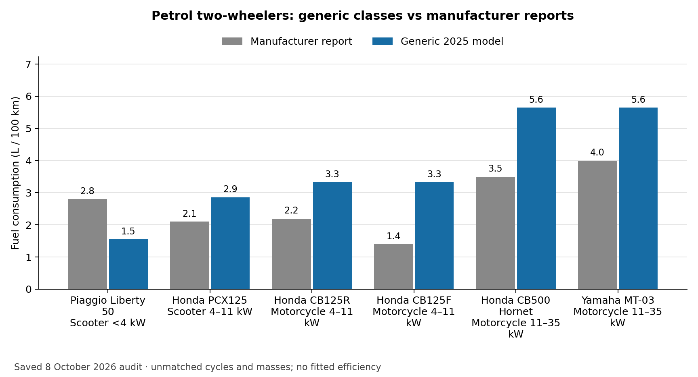
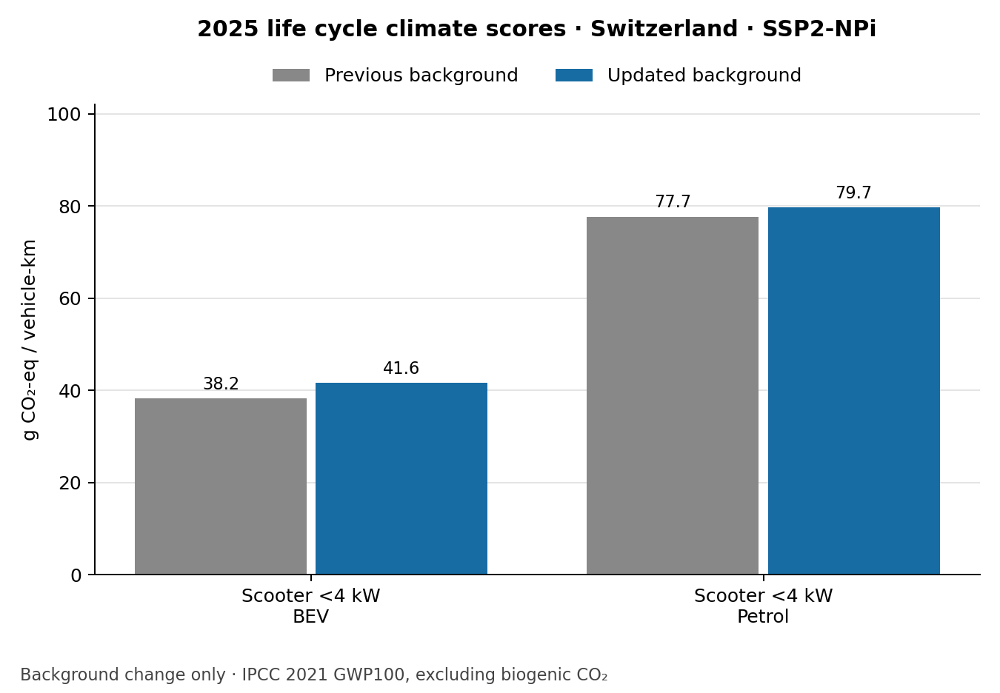

Validation examples: what the comparisons show
==============================================

A completed calculation is necessary but is not enough to establish that the
vehicle represents reality. This page separates comparisons with reported energy
use, checks of the calculation, and changes caused by the background database.
See :doc:`interpretation` for units and :doc:`validity` for detailed checks.

The figures reproduce **saved audits from October 2026**. This documentation
review replotted their recorded numbers; it did not rerun every model or fit
new parameters. Sources and software revisions belong to each audit, so these
figures should not be described as measurements of the latest software release.

Petrol classes: substantial differences remain
----------------------------------------------

   Manufacturer-reported consumption versus generic 2025 classes, in L/100 km.
   These are manufacturer claims, not independent road measurements. Vehicle
   masses, model years and exact cycles do not fully match.
   :download:`Values <_static/validation/two_wheeler_petrol.csv>`.

The previous 0.5–2% engine-efficiency inputs produced implausible consumption.
Restoring the earlier engineering assumptions removed that defect, but did not
fit the model to these manufacturers. For example, the 2025 scooter 4–11 kW
class gives 2.86 L/100 km versus 2.10 reported for the Honda PCX125 (+36%). The
motorcycle 11–35 kW class gives 5.65 versus 3.50 for the CB500 Hornet (+61%).

The Honda CB125F source also has a documented discrepancy: its English table
reports 1.4 L/100 km, while the French narrative gives 1.49. The figure uses
1.4 as recorded in the audit. That uncertainty does not remove the large
difference from the generic model.

See :doc:`petrol_efficiency` for every source, the provisional efficiency values,
uncertainty ranges and reproduction command. No independent matched-cycle BEV
two-wheeler consumption validation was established in this review. Tests of
battery mass/capacity/range coupling establish mathematical consistency, not
measured efficiency; see :doc:`bev_sizing`.

Change in life cycle climate scores
-----------------------------------

The next chart compares **two calculations**, not model outputs with measured
emissions. Both use the same 2025 vehicle inputs and national electricity-supply
settings in Switzerland. Only the bundled background inventory/index and impact
coefficients were changed. The updated bundle was rebuilt with premise and
ecoinvent 3.12 cutoff. The previous bundle is identified by Git revision
``aeace0e53937870fa05ec8aeba392e41d75aaa0b``; it should not be described as a clean
older-ecoinvent baseline because it already contained some newer coefficients.

The displayed scenario is ``SSP2-NPi``. Results are grams CO2-equivalent per
vehicle-km, using IPCC 2021 GWP100 excluding biogenic CO2 within the ``recipe``
midpoint collection. Vehicle masses and consumption were unchanged: all 138
recorded physical outputs matched exactly. The full audit covers 96 combinations
of eight vehicles, three years and four background scenarios.

   Model-to-model background comparison, not measured validation.
   :download:`Values <_static/validation/climate_two_wheeler.csv>`.

Traceable results
-----------------

Download the :download:`plotted values and source checksums
<_static/validation/plot_inputs.json>` and :download:`source manifest
<_static/validation/source_manifest.json>`. The JSON stores observation IDs and,
where recorded in the comparison table, original source URLs. Sources for the
reused diagnostic figures are listed in their linked method pages.

The shared `background-rebuild guide <https://github.com/Laboratory-for-Energy-Systems-Analysis/carculator_utils/blob/master/docs/background_rebuild.rst>`_ contains the
complete climate CSV, software revisions, rebuild report and comparison command.
The `energy evidence guide <https://github.com/Laboratory-for-Energy-Systems-Analysis/carculator_utils/blob/master/docs/energy_measurements.rst>`_ provides the original
measurement catalog, exclusions and run records. These are reproducibility
records, not new evidence of external accuracy.

To redraw the new bar charts from saved results, run from ``carculator_utils``
with Matplotlib installed::

   python scripts/plot_documentation_validation.py --output /tmp/validation-plots

The plotting script does not recalculate vehicles. Reproducing a model audit
requires the matching source revisions and inputs recorded in that audit.
